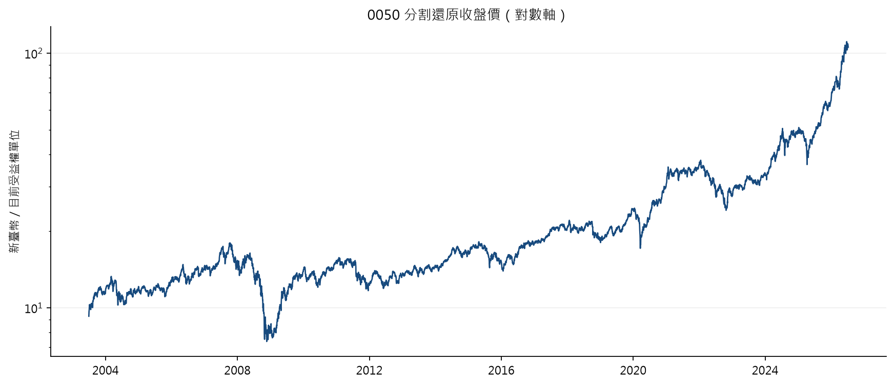
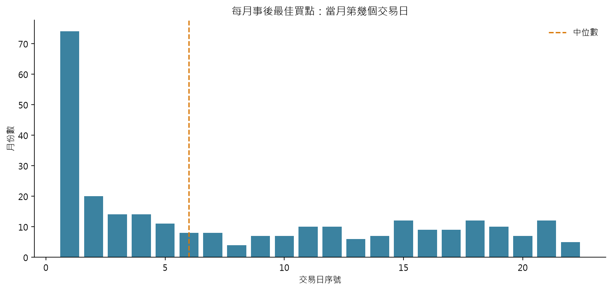
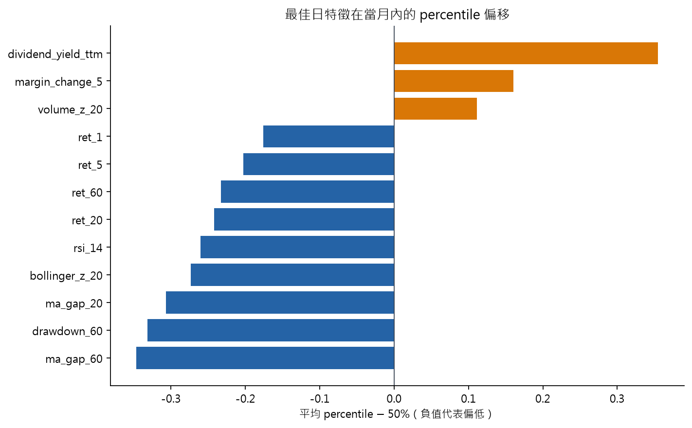
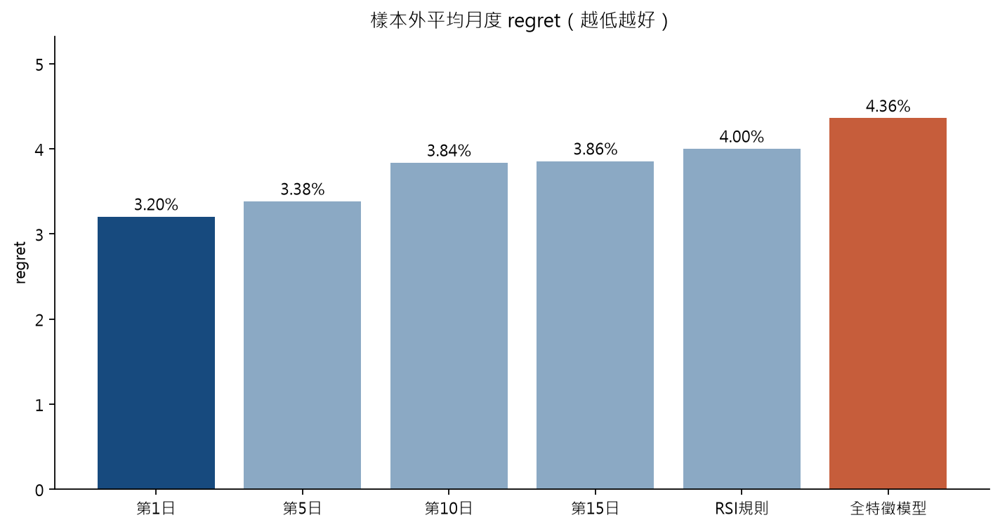
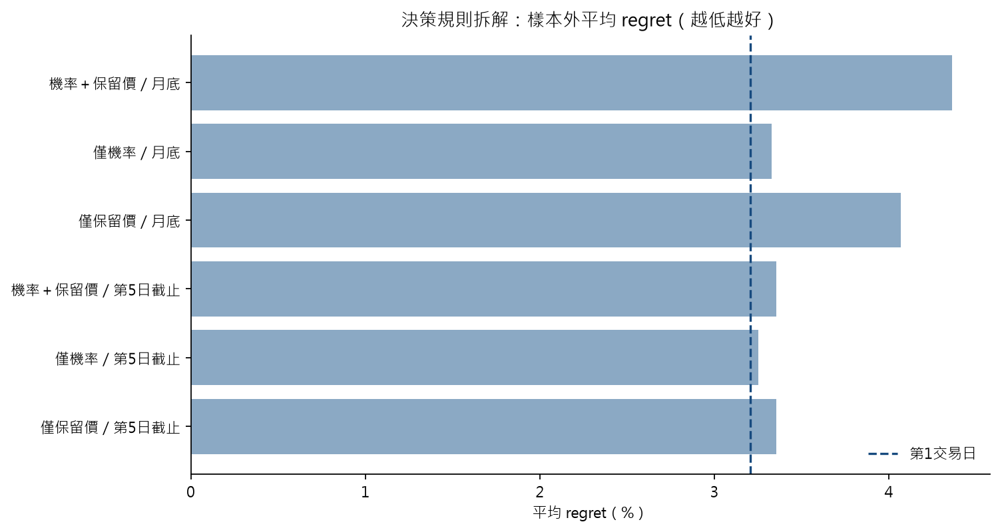
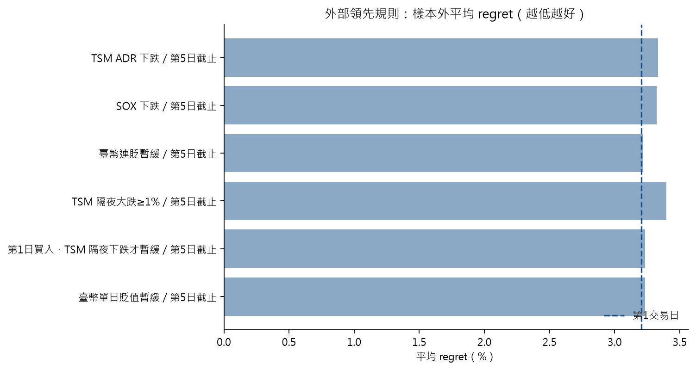

# 0050 每月最佳買點研究

> 結論：若每月必須只買一次，**第 1 個交易日直接買入**是目前最穩健、最可執行的基準。歷史最佳點常伴隨弱勢特徵，但等待這些訊號在樣本外沒有可靠證據優於月初買入。模型、決策規則拆解與外部領先規則亦然：在「每月必買一次、開盤成交、只用 T-1 資訊」的約束下，沒有證據顯示月內擇時能穩定勝過第 1 日。

---

## 1. 研究問題

本研究回答一個實務問題：**對定期定額買入 0050 的投資人，每月只買一次時，選哪一個交易日下單最合理？**

具體而言，我們評估三類策略：
1. **固定日策略**：每月固定在第 N 個交易日買入（N = 1, 5, 10, 15, 最後一日）
2. **規則策略**：等待特定技術訊號觸發（如 RSI < 30）再買，逾時則月底強制買入
3. **機器學習策略**：用歷史特徵訓練模型，逐日判斷是否為好買點

## 2. 核心結論

- 共分析 **276** 個完整月份（2003-07 至 2026-06）。事後最佳日的眾數是第 **1** 個交易日，中位數是第 **6** 日，平均第 **8.4** 日。
- 精確最低點有 **26.8%** 出現在第 1 日，**48.2%** 在前 5 日，**60.5%** 在前 10 日。
- 2008-07 至 2026-06 的 **216 個樣本外月份**：第 1 日平均 regret **3.20%**；全特徵模型 **4.36%**。
- 模型比第 1 日平均差 **116 bps**，95% moving-block bootstrap CI 為 **[-196 bps, -39 bps]**。CI 全數 < 0，等待模型訊號**顯著較差**。
- 最後 **36** 個月的 sealed holdout（2023-07 至 2026-06）仍一致：第 1 日 **2.58%**，模型 **5.79%**；差距 **321 bps**，95% CI **[-498 bps, -151 bps]**。
- 第 1 日有 **38.9%** 的月份落在當月最低價 0.5% 內；holdout 期間更高達 **52.8%**。
- 第 1 日相對第 5 日的平均優勢為 **18 bps**，95% CI **[-38 bps, 73 bps]**，跨過 0 -> 前 1-5 日無統計差異。

## 3. 方法論

### 3.1 Oracle 定義（每月最佳買點）

每月的 oracle 定義為該月 **total-return adjusted 開盤價最低** 的那一天：
- 使用開盤價而非盤中最低價，因為開盤集合競價可確保成交，盤中低點不一定成交。
- 同價時取最早日，避免後見偏差。
- Total-return adjusted price 已將配息再投入與股票分割一併還原，跨期可比。

### 3.2 Regret 指標

`regret = 實際買入 adjusted open / 當月最低 adjusted open - 1`

- Regret >= 0，等於 0 表示恰好買在最低點。
- 越低越好；此指標衡量「離完美的距離」，而非絕對報酬。

### 3.3 特徵設計

所有特徵分為四類，共 22 個：

**技術面（11 個）**：1/5/20/60 日報酬、距 20/60 日均線、RSI(14)、布林 Z(20)、距 60 日高點、20 日年化波動率、成交量 Z(20)。

**估值面（2 個）**：NAV 折溢價、TTM 配息殖利率。

**籌碼面（5 個）**：融資 5 日變化率、融券 5 日變化率、法人淨買賣比、法人資料可得標記、基金流量 5 日變化率。

**日曆面（4 個）**：月內交易日序號、月進度（日曆日比例）、星期三角編碼（sin/cos）。

**關鍵防偷看設計**：所有日終特徵（技術、估值、籌碼）向後延遲一個交易日。日曆特徵無需延遲。月進度使用日曆日比例（date.day / days_in_month）。

### 3.4 模型架構

每月使用兩個模型協作：

1. **分類器（Logistic Regression）**：C=0.1，class_weight=balanced，月內樣本加權使各月等權。
2. **保留價迴歸器（Gradient Boosting Quantile Regressor）**：60 棵樹，max_depth=2，min_samples_leaf=20。

**買入決策規則**：每月從第 1 日起逐日檢查，首個同時滿足 near_probability >= 0.5 且 adjusted open <= 保留價 x 1.005 的交易日即買入。若整月未觸發，最後一日強制買入。

### 3.5 Walk-Forward 設計

- **初始訓練窗口**：前 60 個完整月份。
- **擴展方式**：Expanding window，每月新增一個月的完整資料後重訓。
- **測試集**：下一個月的所有交易日，完全樣本外。
- **樣本外期間**：2008-07 至 2026-06，共 216 個月。
- **Sealed holdout**：2023-07 至 2026-06，共 36 個月。

### 3.6 模型組合

| 模型名稱 | 特徵組合 | 特徵數 |
|---|---|---:|
| 技術＋日曆 | technical + calendar | 15 |
| 技術＋估值＋日曆 | technical + valuation + calendar | 17 |
| 全特徵 | technical + valuation + chip + calendar | 22 |

### 3.7 統計檢驗

策略間比較使用 **paired test** 與 **Moving-Block Bootstrap**（block length = 12 個月、5,000 次重抽樣）。

## 4. 事後最佳日特徵分析

276 個月中 oracle 日的前一日特徵統計（僅描述關聯，不代表因果）：

| 特徵 | Q25 | 中位數 | Q75 | 平均 | 觀測月份 |
|---|---:|---:|---:|---:|---:|
| 開盤 gap（vs 調整前收） | -0.74% | -0.13% | 0.09% | -0.47% | 276 |
| 1 日報酬 | -1.36% | -0.65% | 0.00% | -0.83% | 275 |
| 5 日報酬 | -3.13% | -1.59% | 0.02% | -1.73% | 275 |
| 20 日報酬 | -4.51% | -1.50% | 1.52% | -1.69% | 275 |
| 距 20 日均線 | -3.49% | -1.42% | 0.21% | -1.70% | 275 |
| 距 60 日均線 | -3.79% | -0.57% | 2.50% | -1.05% | 273 |
| RSI(14) | 31.3 | 41.1 | 52.4 | 42.8 | 275 |
| 布林 Z(20) | -1.821 | -1.047 | 0.200 | -0.808 | 275 |
| 距 60 日高點 | -8.58% | -5.20% | -2.61% | -6.73% | 273 |
| 殖利率(TTM) | 2.15% | 3.38% | 3.94% | 3.11% | 276 |
| 溢折價(vs NAV) | -0.19% | 0.03% | 0.23% | 0.01% | 275 |
| 融資 5 日變化率 | -4.84% | 5.13% | 21.60% | 13.51% | 275 |
| 法人淨買賣比 | -0.591 | 0.000 | 0.000 | -0.196 | 276 |
| 量能 Z(20) | -0.555 | 0.106 | 0.878 | 0.338 | 275 |

**解讀**：事後最低點的前一天通常已處於短期弱勢，但嘗試等待這些條件觸發時，模型有超過一半的月份被迫拖到月底強制買入，反而錯過月初的低點。

## 5. 樣本外策略比較（2008-07 至 2026-06，216 個月）

| 策略 | 平均 regret | 中位 regret | P75 | P90 | P95 | ≤0.5% 月份 | ≤1% 月份 | 強制率 | 平均買入日 | 期末財富 |
|---|---:|---:|---:|---:|---:|---:|---:|---:|---:|---:|
| 技術模型 | 4.23% | 3.43% | 5.85% | 9.71% | 11.57% | 13.4% | 22.2% | 54.2% | 15.6 | 17,073,349 |
| 技術＋估值模型 | 4.36% | 3.47% | 5.88% | 9.77% | 11.63% | 13.4% | 21.8% | 56.0% | 15.7 | 17,037,370 |
| 全特徵模型 | 4.36% | 3.44% | 6.01% | 9.77% | 11.63% | 13.9% | 22.7% | 53.2% | 15.6 | 17,037,332 |
| 第 1 交易日 | 3.20% | 1.43% | 4.19% | 8.56% | 11.89% | 38.9% | 46.3% | — | 1.0 | 17,155,040 |
| 第 5 交易日 | 3.38% | 2.48% | 4.33% | 6.60% | 9.27% | 9.3% | 18.1% | — | 5.0 | 17,180,404 |
| 第 10 交易日 | 3.84% | 3.10% | 4.87% | 7.64% | 9.70% | 6.5% | 13.0% | — | 10.0 | 17,112,011 |
| 第 15 交易日 | 3.86% | 3.19% | 5.18% | 7.69% | 10.51% | 8.8% | 15.7% | — | 14.9 | 17,159,091 |
| 月底 | 4.37% | 3.62% | 5.88% | 9.71% | 11.57% | 11.1% | 16.7% | — | 20.4 | 17,064,403 |
| RSI<30／月底 | 4.00% | 2.86% | 5.44% | 9.77% | 11.77% | 17.6% | 24.5% | — | 16.2 | 17,085,534 |

**欄位說明**：regret 越低越好。強制率 = 模型整月未觸發、月底被迫買入的比例。期末財富 = 每月投入 10,000 新臺幣的 total-return 終值。

### 隨機策略基準

每月均勻隨機選一天買入（5,000 次模擬）：平均 regret 3.77%，95% CI [3.43%, 4.11%]。第 1 日 3.20% 低於隨機中位，表示月初的優勢不僅是運氣。

## 6. 模型診斷

| 模型 | 特徵數 | Brier Score | Avg Precision | 強制買入率 | 平均 regret |
|---|---:|---:|---:|---:|---:|
| 技術＋日曆 | 15 | 0.1950 | 0.2257 | 54.2% | 4.23% |
| 技術＋估值＋日曆 | 17 | 0.1948 | 0.2254 | 56.0% | 4.36% |
| 全特徵 | 22 | 0.2055 | 0.2219 | 53.2% | 4.36% |

- **Brier Score**：越低越好（完美 = 0，隨機 = 0.25）。
- **Average Precision**：越高越好。
- **強制買入率**：雙重門檻若過嚴，多數月份會被迫在截止日買入。

## 7. 決策規則拆解（不重訓）

模型預測沿用全特徵模型 walk-forward，只改買入規則。6 組政策在看到樣本外結果前即固定：門檻為「機率＋保留價／僅機率／僅保留價」，截止為「月底強制」或「第 5 交易日」。第 5 日截止來自 0050 第一版已公布的 oracle 前 5 日占比（48.2%），不是從此標的樣本外挑出的參數。

| 決策規則 | 平均 regret | 強制率 | 平均買入日 | vs 第1日 | 95% CI | holdout regret | holdout vs 第1日 | holdout 95% CI |
|---|---:|---:|---:|---:|---:|---:|---:|---:|
| 機率＋保留價／月底 | 4.36% | 53.2% | 15.6 | -116 bps | [-196 bps, -39 bps] | 5.79% | -321 bps | [-498 bps, -151 bps] |
| 僅機率／月底 | 3.33% | 7.9% | 4.0 | -12 bps | [-47 bps, 21 bps] | 3.58% | -100 bps | [-210 bps, -10 bps] |
| 僅保留價／月底 | 4.07% | 0.9% | 11.2 | -86 bps | [-157 bps, -15 bps] | 5.13% | -255 bps | [-414 bps, -95 bps] |
| 機率＋保留價／第5日截止 | 3.35% | 81.9% | 4.6 | -15 bps | [-65 bps, 39 bps] | 3.50% | -92 bps | [-178 bps, -6 bps] |
| 僅機率／第5日截止 | 3.25% | 18.1% | 2.1 | -5 bps | [-27 bps, 21 bps] | 3.22% | -64 bps | [-115 bps, -20 bps] |
| 僅保留價／第5日截止 | 3.35% | 72.2% | 4.4 | -15 bps | [-60 bps, 32 bps] | 3.44% | -86 bps | [-178 bps, 9 bps] |

強制率 = 搜尋窗口內未觸發、於截止日買入的月份比例。正的 vs 第 1 日代表 regret 較低。6 組預先指定政策的樣本外 95% CI 均未全數 > 0，沒有證據顯示改門檻或改截止日優於第 1 交易日。

拿掉保留價後，強制率從 53.2% 降到 7.9%，平均 regret 從 4.36% 降到 3.33%。 第 5 日截止把雙門檻平均 regret 從 4.36% 拉到 3.35%。第 5 日截止列的高強制率表示多數月份在前 5 日沒有訊號、於第 5 日買入，接近固定第 5 日，而不是繼續等待。 holdout 上 6 組相對第 1 日的點估計仍全為負。

## 8. 外部領先規則（不重訓、不掃參）

原三條規則的失敗機制：任意下跌日頻率約一半，配第 5 日截止後幾乎必觸發，等於延後第 1 日；美元／新臺幣連續 3 個交易日升值（臺幣連貶）才暫緩則過稀，幾乎就是第 1 日。修正版在看到樣本外結果前即凍結：隔夜大跌改為預先指定的 1%（經濟整數，不是從樣本外掃出的參數）、改為第 1 日買入僅在 TSM 隔夜下跌時暫緩、匯率改為前一交易日美元／新臺幣升值（臺幣貶值）即暫緩。第 5 日截止仍來自 0050 已公布的 oracle 前 5 日占比（48.2%），不依此標的樣本重估。美股與匯率只使用臺灣交易日曆日前一日（含）已收盤的資料，當日美股不可用於當日開盤決策。買入條件為真則當日開盤買，否則第 5 交易日買。樣本外可對齊比例：TSM 100.0%，SOX 100.0%，USD/TWD 100.0%。

| 決策規則 | 平均 regret | 強制率 | 平均買入日 | vs 第1日 | 95% CI | holdout regret | holdout vs 第1日 | holdout 95% CI |
|---|---:|---:|---:|---:|---:|---:|---:|---:|
| TSM ADR 下跌／第5日截止 | 3.33% | 6.5% | 2.1 | -13 bps | [-35 bps, 10 bps] | 2.72% | -14 bps | [-115 bps, 94 bps] |
| SOX 下跌／第5日截止 | 3.32% | 5.1% | 2.0 | -12 bps | [-27 bps, 5 bps] | 2.83% | -25 bps | [-80 bps, 37 bps] |
| 臺幣連貶暫緩／第5日截止 | 3.22% | 0.5% | 1.1 | -1 bps | [-9 bps, 6 bps] | 2.81% | -23 bps | [-47 bps, -4 bps] |
| TSM 隔夜大跌≥1%／第5日截止 | 3.40% | 26.4% | 3.0 | -19 bps | [-45 bps, 6 bps] | 2.81% | -23 bps | [-122 bps, 83 bps] |
| 第1日買入、TSM 隔夜下跌才暫緩／第5日截止 | 3.23% | 2.3% | 1.8 | -3 bps | [-21 bps, 17 bps] | 2.78% | -20 bps | [-39 bps, -1 bps] |
| 臺幣單日貶值暫緩／第5日截止 | 3.23% | 2.3% | 1.8 | -3 bps | [-17 bps, 12 bps] | 2.97% | -39 bps | [-82 bps, 12 bps] |

6 條預先指定領先規則的樣本外 95% CI 均未全數 > 0，沒有證據顯示優於第 1 交易日。 holdout 上 6 條相對第 1 日的點估計仍全為負。

訊號日頻率：TSM 任意下跌 46.9%、TSM ≥1% 大跌 25.1%、TSM 隔夜下跌（暫緩條件） 46.9%、SOX 任意下跌 45.7%、三日臺幣連貶 12.8%、單日臺幣貶值 48.2%。TSM ADR 下跌／第5日截止：強制率 6.5%、平均第 2.1 日，窗口內未觸發才截止買入，屬過濾。 SOX 下跌／第5日截止：強制率 5.1%、平均第 2.0 日，窗口內未觸發才截止買入，屬過濾。 臺幣連貶暫緩／第5日截止：強制率 0.5%、平均第 1.1 日，幾乎就是第 1 日。 TSM 隔夜大跌≥1%／第5日截止：強制率 26.4%、平均第 3.0 日，窗口內未觸發才截止買入，屬過濾。 第1日買入、TSM 隔夜下跌才暫緩／第5日截止：強制率 2.3%、平均第 1.8 日，屬延後買入而非過濾。 臺幣單日貶值暫緩／第5日截止：強制率 2.3%、平均第 1.8 日，屬延後買入而非過濾。

## 9. Sealed Holdout 驗證（2023-07 至 2026-06，36 個月）

此區間完全未參與任何開發決策。

| 指標 | 第 1 日 | 全特徵模型 |
|---|---:|---:|
| 平均 regret | 2.58% | 5.79% |
| ≤0.5% 月份 | 52.8% | — |
| 差距 | — | -321 bps |
| 95% CI | — | [-498 bps, -151 bps] |

Holdout 差距更大（321 bps），CI 全 < 0。

## 10. 資料與品質

### 10.1 覆蓋範圍

- 每日 OHLCV：**5,665** 筆，2003-06-30 至 2026-07-09。
- 完整月份：276 個（2003-07 至 2026-06）。
- 企業行動：**31** 次配息、**1** 次分割。
- 欄位數：38。

### 10.2 交叉驗證

| 來源 | 涵蓋交易日 | 缺值 | 與 FinMind 最大差異 |
|---|---:|---:|---:|
| TWSE 官方逐月收盤 | 5,665 | 0 | 0.0000 元 |
| 元大官方市價 | 5,664 | 1 | 0.0000 元 |

### 10.3 估值限制

0050 是 ETF，沒有公司層級 EPS。估值只採 point-in-time NAV 折溢價與 trailing distribution yield。

### 10.4 資料來源

- [TWSE 個股日收盤價及月平均價](https://www.twse.com.tw/zh/trading/historical/stock-day-avg.html)
- [元大 0050 歷史 NAV](https://www.yuantaetfs.com/tradeInfo/comparison/0050/NAVhistory)
- [元大 0050 基本資訊與上市日](https://www.yuantaetfs.com/product/detail/0050/Basic_information)
- [FinMind API 文件](https://finmind.github.io/quickstart/)
- [FinMind 美股日線 USStockPrice](https://finmind.github.io/tutor/UnitedStatesMarket/Technical/)
- [FinMind 臺灣銀行匯率 TaiwanExchangeRate](https://finmind.github.io/tutor/ExchangeRate/)
- [TWSE 交易制度](https://www.twse.com.tw/en/products/system/trading.html)

## 11. 圖表

## 12. 限制與注意事項

1. **交易假設**：日線研究，假設小額訂單可在開盤集合競價成交。
2. **關聯非因果**：特徵與最佳日之間是統計關聯，不是因果關係。
3. **正向漂移效應**：第 1 日的優勢主要來自股市長期正向漂移。
4. **單一標的**：本報告只研究 0050；VT 用同一協議複製，結論相同。
5. **Regime change**：所有候選規則都可能因市場環境改變而失效。
6. **手續費與稅**：期末財富含 0.1425% 手續費，未計證交稅。
7. **非投資建議**：本報告是量化研究，不構成個人化投資建議。
8. **月內擇時上限**：oracle 最低點多數不在第 1 日，但那是事後路徑。開盤前可執行訊號未能把這段差距變成樣本外 regret 改善；真過濾反而因截止日買入而更差。繼續掃月內門檻會變成 p-hacking，不是新資訊。

## 13. 尚未檢驗的方向

日頻技術、籌碼、TSM／SOX／匯率在 0050 與 VT 上都沒有樣本外證據贏第 1 日。剩餘機會不是再找「今天是最低點」的日頻指標，而是改「這個月要不要等」或改「這個月買多少」。下列假設必須在看樣本外結果前凍結；門檻不掃參。宣稱優於第 1 日的標準不變：樣本外 95% CI 必須全數 > 0。

### 13.1 月度金額（先驗較高，但是另一個問題）

國發會景氣對策信號、信用利差、估值百分位屬月頻資訊，應用於每月扣款金額，而不是再挑月內交易日。
- **特徵指標**：國發會景氣對策信號（紅藍燈）；as-of 為第 1 日開盤前已公布的上一期，不可用當月事後燈號。
- **問題定義**：藍燈期加碼、紅燈期減碼是否提高累積單位；主指標不再是相對當月 oracle 的 regret。
- **不可宣稱**：尚未回測，不得預設會勝過每月固定金額、第 1 日買入。

### 13.2 月初體制閘門 + 等待（月內擇時裡先驗最高的剩餘項）

已測規則的失敗機制是「每個月都等」：多頭月付出正漂移，抵銷少數抓到低點的月份。改成第 1 日開盤前用慢變數凍結體制：
- 低壓力月：直接第 1 日買（預設）。
- 高壓力月：才啟用預先指定的隔夜大跌等待，第 5 日截止。
- 候選慢變數：VIX 水準或 VIX 減 VIX3M、已實現波動相對 expanding-window 歷史百分位、高收益信用利差、景氣燈。
- 體制在該月第 1 日開盤前凍結，月內不可依新日頻資料改體制。門檻必須預先指定（例如 VIX 大於 20，或波動率大於 expanding 歷史 75 百分位），不可從樣本外挑切點。

### 13.3 真正的隔夜期貨（資訊比 T-1 日線更近）

TSM／SOX 的 T-1 收盤已測過且失敗。更近的開盤前資訊：
- 0050：臺指夜盤相對前一盤後收。
- VT：CME ES 夜盤／開盤前報價相對前一美股常規收盤。
大跌門檻沿用已凍結的 1% 經濟整數，不另掃參。單獨使用仍有過密風險，應與 13.2 體制閘門搭配。缺時間戳來源則不可用當日日線收盤假裝夜盤。

### 13.4 不太可能贏、不要再做

再加 RSI／均線／布林、再掃 dump 門檻或截止日、同市場 T-1 報酬正負號、盤中低點或 VWAP（違反開盤成交假設）。這些不是新資訊。

> [!WARNING]
> **多重比較偏誤（Multiple Comparison Bias / p-hacking）**
> 月內規則的門檻與截止日必須預先指定。從樣本外挑最好的 dump 門檻或截止日，不能當作贏過第 1 日的證據。

## 14. 術語表

| 術語 | 定義 |
|---|---|
| Oracle | 事後回頭看，某月 total-return adjusted 開盤價最低的那天 |
| Regret | 實際買入價與當月最低價的比率 - 1 |
| Walk-forward | 逐月向前滾動的回測法，確保每月預測只用過去資料 |
| Expanding window | 訓練窗口只擴大不縮小 |
| Sealed holdout | 預留的最後一段資料，全程不用於任何開發決策 |
| Total-return adjusted | 將配息再投入與分割還原後的價格，跨期可比 |
| Brier Score | 機率預測的校準指標，0=完美，0.25=隨機二元 |
| Average Precision | 正類檢出品質的加權指標 |
| Moving-block bootstrap | 適用於時間序列的信賴區間估計法 |
| Reservation price | 模型算出的最高可接受買價 |
| 強制買入 | 搜尋窗口內未觸發，於截止日強制執行買入 |
| 截止日 | 未觸發時的買入日；預設月底，拆解與領先規則另測第 5 交易日 |
| TSM lead | 前一美股交易日台積電 ADR 還原報酬（0050 為跨市場隔夜；VT 為同一市場 T-1） |
| SOX lead | 費城半導體指數前一美股交易日還原報酬 |
| USD/TWD 升值 | 美元兌新臺幣即期中間價上升，即臺幣貶值；單日與三日暫緩都是這個方向 |
| 體制閘門 | 第 1 日開盤前凍結的慢變數，決定本月直接買還是等待 |
| 隔夜期貨 | 開盤前已成交的夜盤／盤前期貨報酬；時間戳必須早於目標開盤 |
